# 🏮 绍兴展示网站 (Shaoxing Showcase Web)


欢迎来到绍兴展示网站项目！这是一个展现绍兴独特魅力的网上平台~ 🌟

## ✨ 项目介绍

这是一个专注于展示绍兴地区特色与魅力的全栈应用。项目采用现代化的前后端分离架构，就像绍兴的新与旧完美融合一样，我们的技术选型也是新潮与稳重的黄金组合！

- 💼 后端：强大的 Spring Boot 3 框架
- 🎨 前端：灵活的 Vue.js + Element Plus

## 📸 项目演示
### 美食展示模块
记录绍兴特色美食，支持展示、添加、详情和编辑功能。
<div style="text-align: center;">
   
</div>

### 文化展示模块
展现绍兴独特的文化特色，包含展示、详情和编辑功能。
<div style="text-align: center;">
  
</div>

### 景点展示模块
展示绍兴著名景点，包含列表、详情和编辑功能。
<div style="text-align: center;">
  
</div>

### 用户认证模块
完整的用户认证系统，包含登录、注册和密码找回功能。
<div style="text-align: center;">
  
</div>

### 用户信息管理模块
提供用户信息的查看和编辑功能。
<div style="text-align: center;">

</div>

## 🏗️ 项目结构

```mermaid
graph TB
    subgraph "前端层 Frontend"
        A1[Vue3] --> A2[Element Plus]
        A1 --> A3[Axios]
        A1 --> A4[Pinia状态管理]
    end

    subgraph "后端层 Backend"
        B1[Controller层] --> B2[Service层]
        B2 --> B3[Mapper层]
        B4[Spring Security] --> B1
    end

    subgraph "数据持久层 Database"
        C1[(MySQL Database)]
        C2[MyBatis] --> C1
    end

    A3 -- "HTTP/RESTful API" --> B1
    B3 --> C2

    subgraph "MVC架构详解"
        D1[Controller] --> D2[Service]
        D2 --> D3[Model]
        D1 -- "返回数据" --> D4[View/Frontend]
        D4 -- "用户请求" --> D1
    end

    subgraph "核心业务模块"
        E1[用户管理] 
        E2[文化展示]
        E3[景点展示]
        E4[美食展示]
    end
```


<div style="font-size:14px;color:gray;text-decoration:underline; text-align: center;">图1.系统架构图</div> 

### 🚀 后端项目 (shaoxing-showcase-web-backend)

```
后端技术清单：
- Spring Boot - 为我们提供稳定的框架支持
- Git - 代码版本控制的得力助手
- Maven - 专业可靠的项目构建工具
```

### 🎯 前端项目 (shaoxing-showcase-web-frontend)

```
前端技术清单：
- Vue.js - 新一代的前端框架
- Vite - 闪电般的开发体验
- Element Plus - 优雅的 UI 组件库
```

## 📒 数据库设计

```mermaid
erDiagram

    account {
        int id PK
        string username UK
        string password
        string email UK
        string avatarUrl
    }

    local_culture {
        int id PK
        string culture_name
        text description
        text significance
        string image_url
        string time
    }

    local_sights {
        int id PK
        string sight_name
        string location
        text description
        string image_url
        string opening_hours
    }

    local_foods {
        int id PK
        string food_name
        text description
        text ingredients
        string image_url
        string origin
    }

    persistent_logins {
        string username PK
        string series PK
        string token
        timestamp last_used
    }

    account ||--o| persistent_logins : "记住登录"
```


<div style="font-size:14px;color:gray;text-decoration:underline; text-align: center;">图2.数据库ER图</div>


## 🛠️ 环境要求 (Prerequisites)

在开始部署之前，请确保您的开发环境满足以下要求：

| 组件 | 要求版本 | 说明 |
| :--- | :--- | :--- |
| **Java** | JDK 17+ | 后端运行环境 |
| **Node.js** | v18.0.0+ | 前端构建环境 (推荐 LTS 版本) |
| **MySQL** | 8.0+ | 数据库服务 |
| **Maven** | 3.6+ | 项目构建工具 |

## 🚀 快速开始

```bash
# 克隆前后端项目到本地
git clone https://gitee.com/HexWarrior6/shaoxing-showcase-web.git
```

### 后端环境准备

1. 📥 安装 Maven 和 JDK 17
2. 📂 用你喜欢的 IDE (如 IntelliJ IDEA) 打开项目
3. 🗃️ 配置 MySQL 数据库：
   - 创建数据库 `HexWarrior6shaoxingshowcase`
   - 导入项目中的 [hexwarrior6shaoxingshowcase.sql](doc/deploy/hexwarrior6shaoxingshowcase.sql) 文件
4. ⚙️ **配置修改**：修改 `src/main/resources/application.yaml` 中的数据库连接信息（如用户名、密码）以匹配您的本地环境。

### 前端环境准备

1. 📦 安装 Node.js (v18+)
2. ⚡ 进入前端目录并安装依赖：
   ```bash
   cd shaoxing-showcase-web-frontend
   npm install
   ```
3. 🚀 启动开发服务器

## 🎮 运行项目

### 后端启动

> 选择以下任意一种方式

- 使用 Maven 运行

```bash
# 进入后端文件夹
cd shaoxing-showcase-web-backend
mvn spring-boot:run
```

- 或直接在 IDE (IntelliJ IDEA) 中运行 `SubjectApplication` 类

### 前端启动

```bash
# 进入前端文件夹
cd shaoxing-showcase-web-frontend
```

```bash
# 启动开发服务器
npm run dev
```

访问 http://localhost:5173 注册新账户或使用我们提供的测试账户登录就能看到我们的作品啦！ 🎉

| Username   | Password      |
|:-----------|:--------------|
| `admin123` | `admin123456` |

## 📦 项目依赖

### 后端依赖

- Spring Boot Starter Parent (3.4.1) - 坚实的地基
- Spring Boot Starter Web (8.0.33) - Web 开发必备
- Fastjson2 (2.0.53) - JSON 处理利器
- Lombok - 代码简化神器
- mybatis (3.0.3) - 持久化的好帮手

### 前端依赖

- Axios (1.7.9) - 优雅的 HTTP 客户端
- Element Plus (2.9.1) - 漂亮的 UI 组件库
- Pinia (2.2.6) - 新一代状态管理
- 自动导入插件组合拳 (优化开发体验)
    - Unplugin-auto-import (0.19.0)
    - Unplugin-vue-components (0.28.0)

## 📄 开源协议 (License)

本项目采用 [GPL-3.0](LICENSE) 开源协议。
